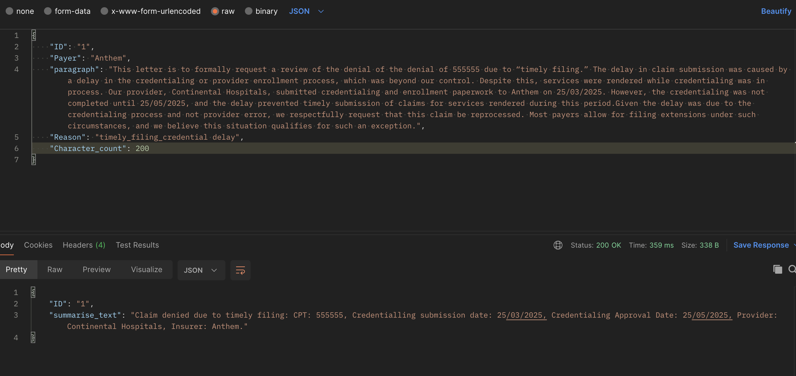

# Medical RCM Summary API (FastAPI + Groq LLM)

This is a lightweight FastAPI backend that uses the Groq language model to generate concise summaries of medical RCM (Revenue Cycle Management) denial paragraphs. It's specifically tailored for scenarios like claim reprocessing, with configurable prompts and response lengths.

## 🔧 Features

* Accepts structured JSON input with claim data and denial reason
* Customizable system prompt and reason-specific prompts
* Uses Groq LLM (`llama-3-3-70b-versatile`) for generation
* Supports character-limited summarization for CPT-related denials
* Clean JSON output with summary text

## 📦 Requirements

```bash
pip install fastapi uvicorn groq pydantic
```

## 🚀 Running the API

```bash
fastapi run groq_test.py
```

Replace `main` with the filename of your script (without `.py`).

## 📥 Sample Input

```json
{
  "ID": "12345",
  "Payer": "Aetna",
  "paragraph": "This letter is to formally request a review of the denial of 102340 due to \"timely filing.\"...",
  "Reason": "timely filing",
  "Character_count": 200
}
```

## 📤 Sample Output

```json
{
  "ID": "12345",
  "summarise_text": "CPT 102340 denied for timely filing. Sent 25/04/2025 to wrong payer, corrected on 25/05/2025."
}
```

## ✏️ Prompts

* **System Prompt**: Instructs the model to behave as an expert in medical RCM.
* **Reason Prompt**: Each denial reason (e.g. "timely filing") can have a custom template. These are defined in the `REASON_PROMPTS` dictionary.

## ⚙️ Configuration

* **Model**: `llama-3-3-70b-versatile` (can be changed)
* **Temperature**: Can be set manually in the `chat_completion` call (default `0.7`)

## 📚 Example Use Case

Used by RCM teams to auto-summarize appeal justifications or denial rebuttal content into concise, character-limited formats for payer resubmission.

## 🛠 Future Enhancements

* Support for multiple models
* Dynamic temperature and model switching
* File upload & batch processing
* More denial reasons and prompts

---

## 📸 Screenshots

### 1. Sample API Input


### 2. Sample API Output

